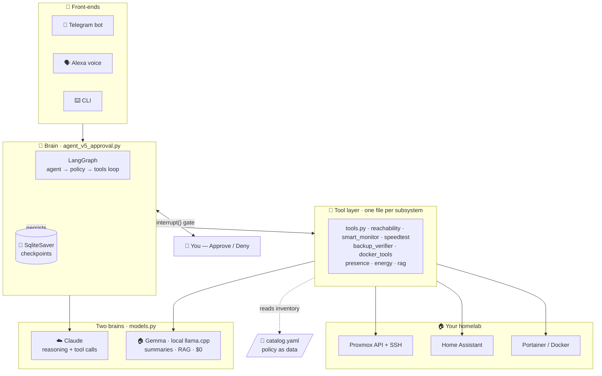
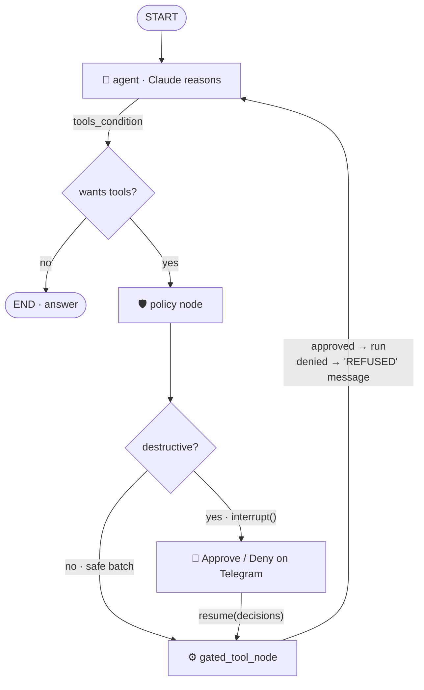
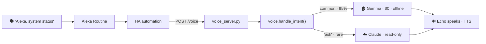

<div align="center">

# 🛰️ HomelabSentinel

### An agentic-AI Site Reliability Engineer for your homelab

**Talk to your infrastructure in plain English.** An LLM reasons over live
Proxmox · Home Assistant · Docker state, decides what's wrong, and
**asks your permission before it changes anything.**


</div>

---

HomelabSentinel is a **production agentic-AI system** that runs 24/7 on an
unprivileged Proxmox LXC. You ask it *"are my backups OK?"* or *"restart Immich"*
over **Telegram** or **Alexa**, and it reasons with an LLM: it picks tools,
gathers live data from Proxmox / Home Assistant / Portainer, decides whether an
action is needed, and — crucially — **stops at a human-approval gate before it
touches anything.**

It's built as a **five-step course** (`agent_v1` → `agent_v5`): the same task
solved five times, each version adding exactly one real production concern — the
raw ReAct loop, a framework, an editable graph, observability, and finally a
human-in-the-loop safety gate. Read them in order and you've learned how to build
agents.

> 📚 **New here?** [`Agent_AI/sentinel-learning-guide.md`](Agent_AI/sentinel-learning-guide.md)
> is a complete, file-by-file teaching guide to the whole system.

---

## ✨ Highlights

- 🛡️ **Human-in-the-loop safety** — every destructive action (`restart_lxc`,
  `restart_docker_container`, `call_ha_service`) is paused at a LangGraph
  [`interrupt()`](Agent_AI/agent_v5_approval.py) gate. You tap **Approve / Deny**
  on Telegram. **Default-deny:** timeout, error, or silence = no.
- 🧠 **Two-brain cost design** — cloud **Claude** reasons; a **local Gemma**
  (llama.cpp) summarizes. Every scheduled monitor and ~95% of voice commands cost
  **$0** and keep working with an empty Anthropic balance.
- 💾 **Resumable** — a SQLite checkpointer persists graph state across the
  interrupt. Approve after dinner; survive a process restart mid-decision.
- 🧱 **Defense in depth** — 8 independent safety layers, from catalog policy
  (`restart_policy: never` for the router) to per-action auth boundaries.
- 🔌 **Three front-ends, one brain** — CLI, Telegram bot, and Alexa voice, wired
  through a dependency-injected approval function. The voice path is
  **read-only by construction** (its approval function always denies).
- 💸 **Token economy** — prompt caching + bounded history + a homemade usage audit
  keep a typical chat at **~$0.005**.
- 🔎 **Local RAG** — BM25 lexical search over your markdown runbooks answers
  *"how do I…"* questions at **zero Claude tokens**.

---

## 🏗️ Architecture



---

## 🧩 The two big ideas

### 1. Reading the world vs. changing it

The whole design turns on one split:

| 🟢 **Read the world** (safe · free · frequent) | 🔴 **Change the world** (dangerous · gated · rare) |
|---|---|
| `check_proxmox_status`, `check_reachability` | `restart_lxc` |
| `check_backups`, `check_presence_state` | `restart_docker_container` |
| `search_docs`, `get_guest_mem_pct` | `call_ha_service` (lights / heat) |
| *run freely* | *every one is stopped at the gate for your tap* |

### 2. Two brains

| | ☁️ **Claude** (cloud) | 🏠 **Gemma** (local llama.cpp) |
|---|---|---|
| **Job** | Multi-step reasoning + tool calls | One-shot "turn this JSON into a sentence" |
| **Used by** | The interactive agent / bot | All 6 monitors, RAG, common voice |
| **Cost** | ~$0.005 / chat (cached) | **$0**, runs offline |

This is why the monitors keep alerting even when the Anthropic balance hits zero.

---

## 📈 The agent in five lessons

Each `agent_v*.py` solves the same task and adds one production concern:

| Version | File | Adds | Concept |
|:--:|---|---|---|
| **v1** | [`agent_v1_raw.py`](Agent_AI/agent_v1_raw.py) | The bare ReAct loop | An agent is a `while` loop over an LLM with tools |
| **v2** | [`agent_v2_langchain.py`](Agent_AI/agent_v2_langchain.py) | The `@tool` decorator | The framework just *hides* the loop |
| **v3** | [`agent_v3_langgraph.py`](Agent_AI/agent_v3_langgraph.py) | An explicit `StateGraph` | The loop becomes **editable data** |
| **v4** | [`agent_v4_langsmith.py`](Agent_AI/agent_v4_langsmith.py) | LangSmith tracing | You can't operate what you can't see |
| **v5** | [`agent_v5_approval.py`](Agent_AI/agent_v5_approval.py) | **Approval gate + checkpointer + token economy** | Editable graph → insert a human gate |

---

## 🔒 The approval gate (v5)

v3's wiring was `agent → tools`. v5 inserts a `policy` node that pauses the entire
graph the moment a destructive tool is requested:



A denial isn't an exception — it's a synthetic `ToolMessage` fed back to Claude
saying *"REFUSED by operator."* On its next turn the model reasons about the
refusal ("the operator declined the restart; I'll just report the problem
instead") instead of blindly retrying.

### Defense in depth — a destructive action must survive all 8 layers

| Layer | Mechanism |
|:--:|---|
| 0 | **Catalog policy** — `restart_policy: never` ⇒ the tool is never even proposed |
| 1 | **System-prompt rules** — "check status before restarting"; distrust ballooned memory |
| 2 | **Read-before-write** — must call `check_*` before any destructive tool |
| 3 | **`policy_node` gate** — `interrupt()` pauses the graph (the hard, code-level stop) |
| 4 | **Human approval** — your physical tap, per action; default-deny |
| 5 | **`gated_tool_node`** — denied id ⇒ tool never runs |
| 6 | **Audit trail** — every ask + execution logged to `audit.log` *and* the chat itself |
| 7 | **Auth boundaries** — bot allow-list · scoped Proxmox token · voice read-only |
| 8 | **Blast-radius limits** — loop bound · tools return dicts not exceptions · token caps |

---

## 📡 Scheduled monitors

Six `systemd` timers run headless, summarize on local Gemma, and ping Telegram
**only when something is wrong**:

| Monitor | Cadence | Checks |
|---|---|---|
| `reachability` | every 5 min | TCP/HTTP probe of every catalogued endpoint |
| `docker` | every 10 min | Container health via Portainer |
| `speedtest` | hourly | WAN download / upload / latency vs thresholds (Cloudflare) |
| `smart` | nightly 02:30 | SMART disk health over SSH (`smartctl`) |
| `backups` | daily 09:00 | Backup freshness vs each service's `max_backup_age_h` |
| `energy` | daily 21:00 | Reset-aware energy digest + tariff cost |

Each also exposes the **same function three ways**: as an agent `@tool`, a CLI
(`python reachability.py --alert`), and a timer job — with a deterministic
fallback so a monitor **never goes silent** if Gemma is down.

---

## 🗣️ Voice — hands-free and (almost) free



Amazon does the speech-to-text (no Whisper). The common intents
(status / backups / energy / disks / presence / docker) run the local monitors
and summarize on Gemma — **zero Claude tokens**, works with an empty balance. See
[`Agent_AI/docs/voice-setup.md`](Agent_AI/docs/voice-setup.md) for the
no-cloud Alexa trigger trick.

---

## 🗂️ Project layout

```
AI-Agent/
├── README.md                 ← you are here
├── .gitignore
└── Agent_AI/                 ← the agent (full source)
    ├── README.md             ← module map + run guide
    ├── agent_v1_raw.py … agent_v5_approval.py   ← the 5-lesson course
    ├── sentinel_bot.py       ← Telegram bot (long-running)
    ├── voice_server.py · voice.py               ← Alexa bridge
    ├── models.py             ← two-brain factory (Claude + Gemma)
    ├── catalog.py            ← pydantic-validated inventory loader
    ├── tools.py              ← Proxmox / HA / Telegram integration + gate
    ├── reachability.py · smart_monitor.py · speedtest_monitor.py
    ├── backup_verifier.py · docker_tools.py
    ├── presence_assistant.py · energy_assistant.py
    ├── rag.py                ← BM25 local RAG over docs/
    ├── docs/                 ← runbook · services · voice setup (RAG corpus)
    ├── systemd/              ← 1 bot service + 6 monitor timers
    ├── .env.example          ← config template (copy → .env)
    └── catalog.example.yaml  ← inventory template (copy → catalog.yaml)
```

---

## 🚀 Quickstart

```bash
cd Agent_AI
cp .env.example .env                 # add your tokens
cp catalog.example.yaml catalog.yaml # describe your homelab
uv sync

uv run python agent_v5_approval.py   # interactive agent + approval gate
uv run python sentinel_bot.py        # the always-on Telegram bot
uv run python rag.py "how do I restart the bot?"   # offline, zero tokens
```

Full details in [`Agent_AI/README.md`](Agent_AI/README.md).

---

## 🧰 Tech stack

`Python 3.14` · `LangGraph` · `LangChain` · `Anthropic Claude` ·
`llama.cpp` (local Gemma) · `FastAPI` · `Pydantic v2` · `SQLite` checkpointer ·
`systemd` · `Proxmox API` · `Home Assistant API` · `Portainer` · `Telegram Bot API` ·
BM25 RAG.

## 🔐 Security & secrets

- All credentials come from environment variables — **nothing is hardcoded.**
- `.env` and your real `catalog.yaml` are **gitignored**; commit only the
  `*.example` templates.
- The gate is **default-deny**; the voice path is **read-only by construction**;
  Proxmox/Portainer use **scoped, revocable tokens**.

---

<div align="center">

Part of my homelab work — see the
**[portfolio ↗](https://github.com/naveen6gowda/homelab-projects)**

</div>
