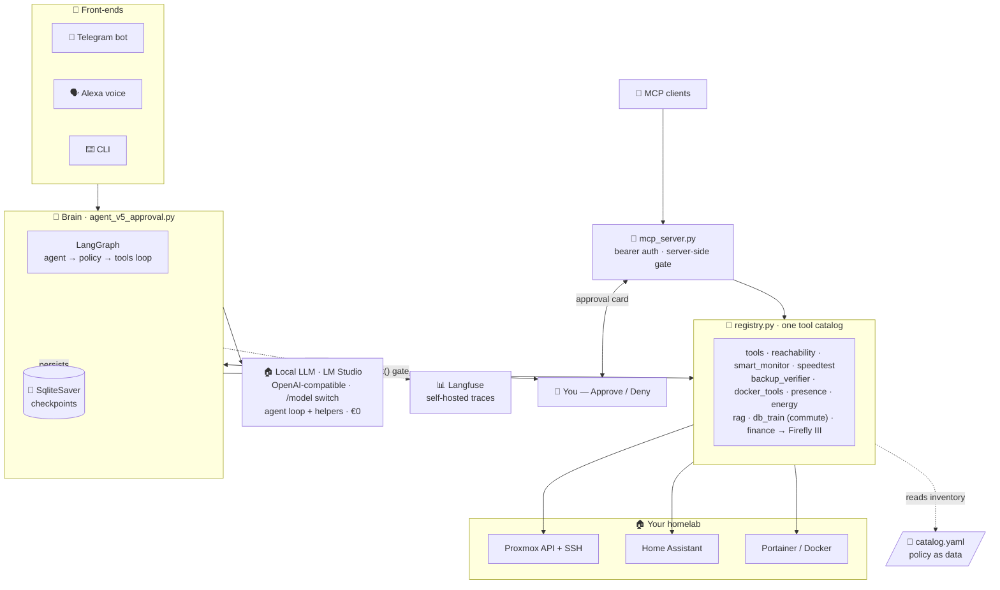

<p align="center">
  
</p>

<p align="center">
  <a href="https://github.com/naveen6gowda/AI-Agent/actions/workflows/ci.yml"></a>
  
  
  
  
  
  
  
  <a href="LICENSE"></a>
</p>

<p align="center">
  <a href="#demo"><b>Demo</b></a> ·
  <a href="#highlights"><b>Highlights</b></a> ·
  <a href="#architecture"><b>Architecture</b></a> ·
  <a href="#gate"><b>Approval gate</b></a> ·
  <a href="#production"><b>In production</b></a> ·
  <a href="#quickstart"><b>Quickstart</b></a>
</p>

---

**HomelabSentinel** is an agentic-AI site-reliability engineer that runs 24/7 in an unprivileged Proxmox LXC. Ask it *“are my backups OK?”* or *“restart Immich”* over **Telegram** or **Alexa**, and a local LLM picks tools, gathers live data from Proxmox, Home Assistant and Portainer, decides whether an action is needed — and **stops at a human-approval gate before it touches anything.**

The agent was built in **five explicit versions** (archived in [`Agent_AI/legacy/`](Agent_AI/legacy/)): the same task solved five times, each adding one production concern — the raw ReAct loop, a framework, an editable graph, observability, and finally a human-in-the-loop safety gate. Read them in order and you’ve learned how to build agents.

> [!TIP]
> **New here?** [`sentinel-flow-guide.md`](Agent_AI/sentinel-flow-guide.md) walks one message through the whole system; [`sentinel-learning-guide.md`](Agent_AI/sentinel-learning-guide.md) is a file-by-file teaching guide.
> **How it got here:** [`docs/ARCHITECTURE.md`](Agent_AI/docs/ARCHITECTURE.md) is the architecture review whose roadmap — tool registry → MCP server → eval harness — is fully shipped.

<a id="demo"></a>

## 🎥 Demo

https://github.com/user-attachments/assets/61a1c8c4-5873-426c-a629-a09e716ecd6f

<a id="highlights"></a>

## ✨ Highlights

<table>
  <tr>
    <td width="50%" valign="top">
      <h4>🛡️ Human-in-the-loop safety</h4>
      Every destructive action (<code>restart_lxc</code>, <code>restart_docker_container</code>, <code>call_ha_service</code>) pauses at a LangGraph <a href="Agent_AI/agent_v5_approval.py"><code>interrupt()</code></a> gate. You tap <b>Approve / Deny</b> on Telegram. <b>Default deny:</b> timeout, error or silence means no.
    </td>
    <td width="50%" valign="top">
      <h4>🏠 100% local LLM</h4>
      One model served by LM Studio (OpenAI-compatible) powers the agent loop <i>and</i> every helper. Marginal cost: <b>€0</b>. Switch models at runtime with Telegram <code>/model</code> — a <b>probe-before-switch</b> refuses any model the server can’t actually run.
    </td>
  </tr>
  <tr>
    <td width="50%" valign="top">
      <h4>🔌 MCP server, same gate</h4>
      The same tool registry is served to any MCP client over streamable HTTP + bearer auth. A destructive call from an external AI still lands as an Approve/Deny card on the operator’s phone (<a href="Agent_AI/mcp_server.py"><code>mcp_server.py</code></a>).
    </td>
    <td width="50%" valign="top">
      <h4>💾 Resumable decisions</h4>
      A SQLite checkpointer persists graph state across the interrupt. Approve after dinner; survive a process restart mid-decision. A nightly job prunes and vacuums the checkpoint DB.
    </td>
  </tr>
  <tr>
    <td width="50%" valign="top">
      <h4>🧪 Measured, not assumed</h4>
      <b>125 tests</b> (pytest + ruff) in GitHub Actions, plus <b>16 golden scenarios</b> that run the real graph against the live model (<a href="Agent_AI/evals/"><code>evals/</code></a>). The one long-standing eval “failure” was root-caused to a stale test, not the model.
    </td>
    <td width="50%" valign="top">
      <h4>🚨 The watcher is watched</h4>
      Every systemd unit carries <code>OnFailure=</code>, paging the operator on Telegram with the journal tail. The alert path is independent of the agent, the bot and the LLM.
    </td>
  </tr>
  <tr>
    <td width="50%" valign="top">
      <h4>📊 Observability</h4>
      Agent runs, tool calls and token counts land in <b>self-hosted Langfuse</b> — chosen over a SaaS tracer so the traces stay home.
    </td>
    <td width="50%" valign="top">
      <h4>🔎 Local RAG</h4>
      BM25 lexical search over markdown runbooks answers <i>“how do I…”</i> questions fully offline; nightly conversation digests are folded back into the index.
    </td>
  </tr>
</table>

<a id="architecture"></a>

## 🏗️ Architecture



### Reading the world vs. changing it

The whole design turns on one split:

| 🟢 **Read the world** — safe · free · frequent | 🔴 **Change the world** — dangerous · gated · rare |
|---|---|
| `check_proxmox_status`, `check_reachability` | `restart_lxc` |
| `check_backups`, `check_presence_state` | `restart_docker_container` |
| `search_docs`, `get_guest_mem_pct` | `call_ha_service` (lights / heating) |
| *run freely* | *every one stops at the gate for your tap* |

### Local-first economics

Earlier versions ran a hybrid: a cloud model for reasoning plus a second local model for summaries. Both the cloud dependency and the second moving part were removed **on purpose** — today there is exactly **one** language model in the system, local and swappable at runtime.

| | Before (hybrid) | Now (single local LLM) |
|---|---|---|
| **Reasoning + tool calls** | Cloud API (~$0.005 / chat) | Local model · **€0** |
| **Summaries / RAG / voice** | Second local model | The *same* local model |
| **Failure modes** | Two servers, two auth paths | One server; monitors stay deterministic if it’s down |
| **Model choice** | Code change | Telegram `/model` + probe-before-switch |

<a id="gate"></a>

## 🔒 The approval gate

v3’s wiring was `agent → tools`. v5 inserts a `policy` node that pauses the entire graph the moment a destructive tool is requested:


A denial isn’t an exception — it’s a synthetic `ToolMessage` fed back to the model saying *“REFUSED by operator.”* On its next turn the model reasons about the refusal (*“the operator declined the restart; I’ll just report the problem”*) instead of blindly retrying.

<details>
<summary><b>Defense in depth — a destructive action must survive all 8 layers</b></summary>

<br>

| Layer | Mechanism |
|:--:|---|
| 0 | **Catalog policy** — `restart_policy: never` ⇒ the tool is never even proposed |
| 1 | **System-prompt rules** — check status before restarting; distrust ballooned memory |
| 2 | **Read-before-write** — must call `check_*` before any destructive tool |
| 3 | **`policy_node` gate** — `interrupt()` pauses the graph (the hard, code-level stop) |
| 4 | **Human approval** — your physical tap, per action; default deny |
| 5 | **`gated_tool_node`** — a denied id ⇒ the tool never runs |
| 6 | **Audit trail** — every ask and execution logged to `audit.log` *and* the chat |
| 7 | **Auth boundaries** — bot allow-list · scoped Proxmox token · voice read-only |
| 8 | **Blast-radius limits** — loop bound · tools return dicts, not exceptions · token caps |

</details>

## 📈 The agent in five lessons

Each version (archived in [`Agent_AI/legacy/`](Agent_AI/legacy/)) solves the same task and adds one production concern:

| Version | File | Adds | Concept |
|:--:|---|---|---|
| **v1** | [`legacy/agent_v1_raw.py`](Agent_AI/legacy/agent_v1_raw.py) | The bare ReAct loop | An agent is a `while` loop over an LLM with tools |
| **v2** | [`legacy/agent_v2_langchain.py`](Agent_AI/legacy/agent_v2_langchain.py) | The `@tool` decorator | The framework just *hides* the loop |
| **v3** | [`legacy/agent_v3_langgraph.py`](Agent_AI/legacy/agent_v3_langgraph.py) | An explicit `StateGraph` | The loop becomes **editable data** |
| **v4** | [`legacy/agent_v4_langsmith.py`](Agent_AI/legacy/agent_v4_langsmith.py) | Tracing | You can’t operate what you can’t see — production now uses **self-hosted Langfuse** |
| **v5** | [`agent_v5_approval.py`](Agent_AI/agent_v5_approval.py) | **Approval gate + checkpointer** | Editable graph → insert a human gate |

## 📡 Scheduled monitors

Systemd timers run headless, summarize on the local model, and message Telegram **only when something changes** — one DOWN, one RECOVERED, a reminder every 6 h ([`alert_state.py`](Agent_AI/alert_state.py)):

| Monitor | Cadence | Checks |
|---|---|---|
| `reachability` | every 5 min | TCP/HTTP probe of every catalogued endpoint |
| `docker` | every 10 min | Container health via Portainer |
| `db-train` | 5 min, Mon–Fri 06–09 | S-Bahn + feeder-bus commute delays (MVG departures API) → Alexa announces |
| `speedtest` | every 4 h | WAN download / upload / latency vs thresholds |
| `smart` | nightly 02:30 | SMART disk health over SSH (`smartctl`) |
| `maintenance` | nightly 03:30 | Checkpoint-DB retention: prune idle threads, cap history, VACUUM |
| `backups` | daily 09:00 | Backup freshness vs each service’s `max_backup_age_h` |
| `energy` | daily 21:00 | Reset-aware energy digest + tariff cost |
| `esphome` | every 2 min | ESPHome nodes online/offline through Home Assistant, with an OTA grace period |
| `guests` | every 15 min | Every Proxmox VM/LXC: running? real memory use? |
| `gitmirror` | nightly 04:15 | Commit → `ruff` → `pytest` → push; a red check pages instead of pushing |

Each monitor exposes the **same function three ways** — an agent `@tool`, a CLI (`python reachability.py --alert`), and a timer job — with a deterministic fallback so a monitor **never goes silent** when the LLM is down.

<details>
<summary><b>💶 Beyond ops — life automations on the same platform</b></summary>

<br>

- **Commute guard** (`db_train_monitor.py`) — polls the MVG departures API for the S-Bahn and feeder bus during the morning window; delays and cancellations are announced on the Echo. State-tracked, so it re-announces only when the delay *changes*.
- **Finance bridge** (`finance_server.py` + `firefly_client.py`) — a bank-app push notification is caught by Home Assistant, POSTed to a FastAPI bridge, parsed (amount / merchant / direction) and filed as a draft transaction in **Firefly III**.
- **Voice** — *“Alexa, system status”* → Alexa Routine → HA automation → `POST /voice` → `voice.handle_intent()` → local LLM → the Echo speaks. Amazon does the speech-to-text; the voice path is **read-only by construction**. See [`docs/voice-setup.md`](Agent_AI/docs/voice-setup.md).

</details>

<a id="production"></a>

## 🏭 In production: what running it 24/7 changed

A demo agent and an agent that pages you at 3 a.m. are different products. These changes came from watching Sentinel in production:

| | Observed | Change |
|:--:|---|---|
| 🧪 | Policy-gate tests found a default-allow hole: a malformed resume payload let a destructive call run | Only explicitly approved tool-call IDs execute — [`test_policy_gate.py`](Agent_AI/tests/test_policy_gate.py) |
| 🩺 | Raw “unit failed” pages were unreadable; a finding looked the same as a broken check | Exit code 1 = the check broke, 2 = it found something; plain-English pages — [`failure_alert.py`](Agent_AI/failure_alert.py) |
| 🙋 | A stopped container was reported, but nothing offered a fix | *Restart / Leave it* card from the Docker monitor — default deny, cooldowns, max three cards per run — [`docker_tools.py`](Agent_AI/docker_tools.py) |
| 🧠 | Helper summaries came back empty: a reasoning model spent its budget thinking | Reasoning disabled for helper calls — 82.5 s (empty) → 5.3 s — [`models.py`](Agent_AI/models.py) |
| 🔇 | Tool spans vanished from traces; an import guard hid an SDK / LangChain 1.x break | Compatibility shim + end-to-end trace check — [`langfuse_compat.py`](Agent_AI/langfuse_compat.py) |
| 🚦 | A hot-fix reached the mirror unlinted and turned CI red | The nightly sync runs ruff and pytest before it pushes — [`git_mirror.sh`](Agent_AI/git_mirror.sh) |
| 📋 | One-shot init containers that exit cleanly paged on every run | Explicit `expected_down` allowlist, not an exit-code heuristic — a stopped service also exits 0 — [`test_docker_ignore.py`](Agent_AI/tests/test_docker_ignore.py) |
| 🔔 | The same alert repeated on every run | Transition paging: one DOWN, one RECOVERED, a 6-hour reminder, quiet hours for non-critical — [`alert_state.py`](Agent_AI/alert_state.py) |
| 📡 | ESP32 devices could drop off unnoticed | ESPHome online/offline watch through Home Assistant, with a grace period for OTA reboots — [`esphome_monitor.py`](Agent_AI/esphome_monitor.py) |
| 🖥️ | Nothing watched VM/LXC state | Guest monitor: every VM/LXC, running state and real memory — [`guest_monitor.py`](Agent_AI/guest_monitor.py) |
| ⛔ | A “never restart” policy was only advisory | `restart_policy: never` enforced in code, even after an approval — [`test_alerting.py`](Agent_AI/tests/test_alerting.py) |

> [!NOTE]
> This repository is a **sanitized mirror** of the live system (private IPs → `*.lan`, names and credentials → placeholders). Everything above ships here: **32 tools and 125 tests**, green in CI. The review behind these changes is §6 of [`ARCHITECTURE.md`](Agent_AI/docs/ARCHITECTURE.md).

## 🗂️ Project layout

```
AI-Agent/
├── README.md                 ← you are here
├── assets/                   ← README visuals
└── Agent_AI/                 ← the agent (full source)
    ├── README.md             ← module map + run guide
    ├── agent_v5_approval.py  ← the production brain (graph + gate)
    ├── registry.py           ← all 32 @tool definitions, one catalog
    ├── mcp_server.py         ← MCP over streamable HTTP, server-side gate
    ├── legacy/               ← the 5-lesson course (v1 → v4 archive)
    ├── sentinel_bot.py       ← Telegram bot (long-running)
    ├── voice_server.py · voice.py               ← Alexa bridge
    ├── finance_server.py · finance_parser.py · firefly_client.py
    ├── models.py             ← single-LLM factory (local, OpenAI-compatible)
    ├── catalog.py            ← pydantic-validated inventory + policy loader
    ├── tools.py              ← Proxmox / HA / Telegram integration + gate
    ├── reachability.py · smart_monitor.py · speedtest_monitor.py
    ├── backup_verifier.py · docker_tools.py · db_train_monitor.py
    ├── presence_assistant.py · energy_assistant.py
    ├── esphome_monitor.py · guest_monitor.py
    ├── alert_state.py        ← transition paging: DOWN / RECOVERED / reminder
    ├── checkpoint_maintenance.py · failure_alert.py · git_mirror.sh   ← reliability jobs
    ├── langfuse_compat.py    ← keeps Langfuse tracing working on LangChain 1.x
    ├── rag.py                ← BM25 local RAG over docs/
    ├── evals/                ← golden scenarios + runner (live model)
    ├── tests/                ← pytest: policy gate, clients, MCP, evals
    ├── docs/                 ← runbook · services · voice setup · ARCHITECTURE.md
    ├── systemd/              ← 4 services + 11 timers + OnFailure alert template
    ├── .env.example          ← config template (copy → .env)
    └── catalog.example.yaml  ← inventory template (copy → catalog.yaml)
```

<a id="quickstart"></a>

## 🚀 Quickstart

```bash
cd Agent_AI
cp .env.example .env                 # add your tokens + LLM endpoint
cp catalog.example.yaml catalog.yaml # describe your homelab
uv sync

uv run python agent_v5_approval.py   # interactive agent + approval gate
uv run python sentinel_bot.py        # the always-on Telegram bot
uv run python rag.py "how do I restart the bot?"   # offline doc search
uv run pytest -q                     # the test suite CI runs
```

Full details in [`Agent_AI/README.md`](Agent_AI/README.md).

## 🧰 Tech stack

`Python 3.14` · `LangGraph` · `langchain-core` · **local LLM** via LM Studio (OpenAI-compatible) · `MCP` · `Langfuse` (self-hosted) · `FastAPI` · `Pydantic v2` · `SQLite` checkpointer · `systemd` · `Proxmox API` · `Home Assistant API` · `Portainer` · `Telegram Bot API` · `Firefly III` · MVG departures API · BM25 RAG · `pytest` · `ruff` · GitHub Actions.

## 🔐 Security & secrets

- All credentials come from environment variables — **nothing is hardcoded.**
- `.env` and the real `catalog.yaml` are **gitignored**; only the `*.example` templates are committed.
- The gate is **default deny**; the voice path is **read-only by construction**; Proxmox and Portainer use **scoped, revocable tokens**.
- Unit failures **page the operator** — silence is treated as a bug.

---

<div align="center">

Built by **Naveen Kumar** · part of my engineering portfolio — **[Portfolio ↗](https://github.com/naveen6gowda/Portfolio)** · [LinkedIn](https://www.linkedin.com/in/naveen-kumar-73423420/)

</div>
