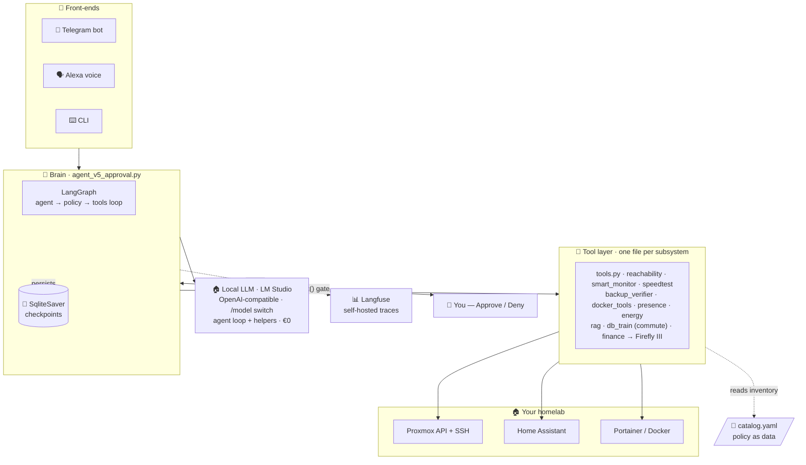
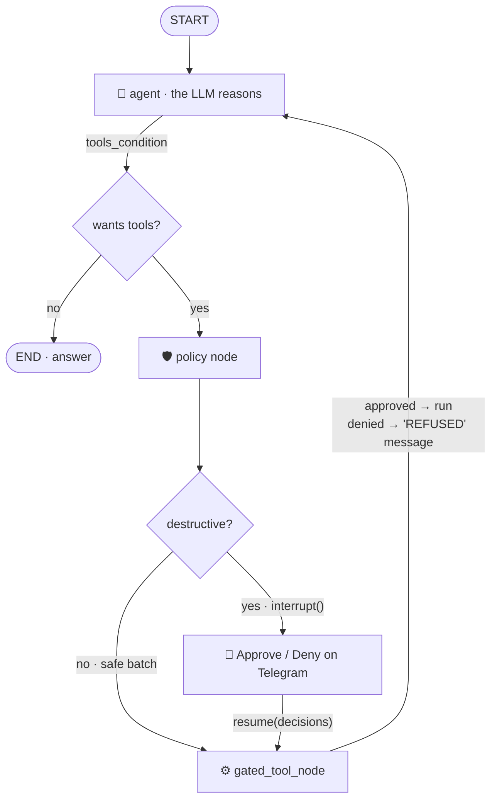
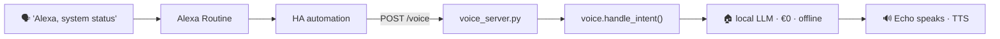

<div align="center">

# 🛰️ HomelabSentinel

### An agentic-AI Site Reliability Engineer for your homelab

**Talk to your infrastructure in plain English.** An LLM reasons over live
Proxmox · Home Assistant · Docker state, decides what's wrong, and
**asks your permission before it changes anything.**


</div>

---

HomelabSentinel is a **production agentic-AI system** that runs 24/7 on an
unprivileged Proxmox LXC. You ask it *"are my backups OK?"* or *"restart Immich"*
over **Telegram** or **Alexa**, and it reasons with an LLM: it picks tools,
gathers live data from Proxmox / Home Assistant / Portainer, decides whether an
action is needed, and — crucially — **stops at a human-approval gate before it
touches anything.**

The agent was built in **five explicit versions** (now archived in
[`Agent_AI/legacy/`](Agent_AI/legacy/)): the same task solved five times, each
adding exactly one production concern — the raw ReAct loop, a framework, an
editable graph, observability, and finally a human-in-the-loop safety gate.
Read them in order and you've learned how to build agents.

> 📚 **New here?** [`Agent_AI/sentinel-learning-guide.md`](Agent_AI/sentinel-learning-guide.md)
> is a complete, file-by-file teaching guide to the whole system.
> 📐 **Where it's going:** [`Agent_AI/docs/ARCHITECTURE.md`](Agent_AI/docs/ARCHITECTURE.md)
> is the honest architecture review + the phased roadmap (tool registry → MCP
> server → eval harness).

---

## ✨ Highlights

- 🛡️ **Human-in-the-loop safety** — every destructive action (`restart_lxc`,
  `restart_docker_container`, `call_ha_service`) is paused at a LangGraph
  [`interrupt()`](Agent_AI/agent_v5_approval.py) gate. You tap **Approve / Deny**
  on Telegram. **Default-deny:** timeout, error, or silence = no.
- 🏠 **100% local LLM** — one model served by LM Studio (OpenAI-compatible)
  powers the agent loop *and* every helper. Marginal cost: **€0.** The
  operator switches models at runtime via Telegram `/model` — with a
  **probe-before-switch** that refuses any model the server can't actually run.
- 💾 **Resumable** — a SQLite checkpointer persists graph state across the
  interrupt. Approve after dinner; survive a process restart mid-decision.
- 📊 **Observability** — every agent run, tool call, and token count lands in
  **self-hosted Langfuse** (chosen over LangSmith: your traces stay home).
- 🧱 **Defense in depth** — 8 independent safety layers, from catalog policy
  (`restart_policy: never` for the router) to per-action auth boundaries.
- 🚨 **The watcher is watched** — every systemd unit carries an `OnFailure=`
  hook that pages the operator on Telegram with the journal tail. A nightly
  retention job prunes the checkpoint DB (learned the hard way at 274 MB).
- 🔌 **Three front-ends, one brain** — CLI, Telegram bot, and Alexa voice, wired
  through a dependency-injected approval function. The voice path is
  **read-only by construction** (its approval function always denies).
- 🔎 **Local RAG** — BM25 lexical search over your markdown runbooks answers
  *"how do I…"* questions fully offline.

---

## 🏗️ Architecture



---

## 🧩 The two big ideas

### 1. Reading the world vs. changing it

The whole design turns on one split:

| 🟢 **Read the world** (safe · free · frequent) | 🔴 **Change the world** (dangerous · gated · rare) |
|---|---|
| `check_proxmox_status`, `check_reachability` | `restart_lxc` |
| `check_backups`, `check_presence_state` | `restart_docker_container` |
| `search_docs`, `get_guest_mem_pct` | `call_ha_service` (lights / heat) |
| *run freely* | *every one is stopped at the gate for your tap* |

### 2. Local-first economics

Earlier versions ran a hybrid (cloud model for reasoning + a second local model
for summaries). Both cloud dependency and the second moving part were removed
**on purpose**: today there is exactly **one** language model in the whole
system — local, OpenAI-compatible, swappable at runtime.

| | Before (hybrid) | Now (single local LLM) |
|---|---|---|
| **Reasoning + tool calls** | Cloud API (~$0.005/chat) | Local model · **€0** |
| **Summaries / RAG / voice** | Second local model | The *same* local model |
| **Failure modes** | Two servers, two auth paths | One server; monitors stay deterministic if it's down |
| **Model choice** | Code change | Telegram `/model` + probe-before-switch |

The scheduled monitors never need the LLM to *detect* problems — a monitor
**never goes silent** because a model is down.

---

## 📈 The agent in five lessons

Each version (archived in [`Agent_AI/legacy/`](Agent_AI/legacy/)) solves the
same task and adds one production concern:

| Version | File | Adds | Concept |
|:--:|---|---|---|
| **v1** | [`legacy/agent_v1_raw.py`](Agent_AI/legacy/agent_v1_raw.py) | The bare ReAct loop | An agent is a `while` loop over an LLM with tools |
| **v2** | [`legacy/agent_v2_langchain.py`](Agent_AI/legacy/agent_v2_langchain.py) | The `@tool` decorator | The framework just *hides* the loop |
| **v3** | [`legacy/agent_v3_langgraph.py`](Agent_AI/legacy/agent_v3_langgraph.py) | An explicit `StateGraph` | The loop becomes **editable data** |
| **v4** | [`legacy/agent_v4_langsmith.py`](Agent_AI/legacy/agent_v4_langsmith.py) | Tracing (LangSmith era) | You can't operate what you can't see — production now uses **self-hosted Langfuse** |
| **v5** | [`agent_v5_approval.py`](Agent_AI/agent_v5_approval.py) | **Approval gate + checkpointer** | Editable graph → insert a human gate |

---

## 🔒 The approval gate (v5)

v3's wiring was `agent → tools`. v5 inserts a `policy` node that pauses the entire
graph the moment a destructive tool is requested:



A denial isn't an exception — it's a synthetic `ToolMessage` fed back to the
model saying *"REFUSED by operator."* On its next turn the model reasons about
the refusal ("the operator declined the restart; I'll just report the problem
instead") instead of blindly retrying.

### Defense in depth — a destructive action must survive all 8 layers

| Layer | Mechanism |
|:--:|---|
| 0 | **Catalog policy** — `restart_policy: never` ⇒ the tool is never even proposed |
| 1 | **System-prompt rules** — "check status before restarting"; distrust ballooned memory |
| 2 | **Read-before-write** — must call `check_*` before any destructive tool |
| 3 | **`policy_node` gate** — `interrupt()` pauses the graph (the hard, code-level stop) |
| 4 | **Human approval** — your physical tap, per action; default-deny |
| 5 | **`gated_tool_node`** — denied id ⇒ tool never runs |
| 6 | **Audit trail** — every ask + execution logged to `audit.log` *and* the chat itself |
| 7 | **Auth boundaries** — bot allow-list · scoped Proxmox token · voice read-only |
| 8 | **Blast-radius limits** — loop bound · tools return dicts not exceptions · token caps |

---

## 📡 Scheduled monitors & reliability

Systemd timers run headless, summarize on the local model, and ping Telegram
**only when something is wrong**:

| Monitor | Cadence | Checks |
|---|---|---|
| `reachability` | every 5 min | TCP/HTTP probe of every catalogued endpoint |
| `docker` | every 10 min | Container health via Portainer |
| `db-train` | 5 min, Mon–Fri 06–09 | S-Bahn + feeder-bus commute delays (MVG departures API) → Alexa announces |
| `speedtest` | every 4 h | WAN download / upload / latency vs thresholds |
| `smart` | nightly 02:30 | SMART disk health over SSH (`smartctl`) |
| `maintenance` | nightly 03:30 | Checkpoint-DB retention: prune idle threads, cap history, VACUUM |
| `backups` | daily 09:00 | Backup freshness vs each service's `max_backup_age_h` |
| `energy` | daily 21:00 | Reset-aware energy digest + tariff cost |

**Who watches the watchers?** Every unit carries
`OnFailure=sentinel-failure-alert@%n.service` — a failed monitor pages the
operator on Telegram with the last journal lines. The alert path is
deliberately independent of the agent, the bot, and the LLM.

Each monitor also exposes the **same function three ways**: as an agent `@tool`,
a CLI (`python reachability.py --alert`), and a timer job — with a deterministic
fallback so a monitor **never goes silent** if the LLM is down.

---

## 💶 Beyond ops — life automations on the same platform

- **Commute guard** (`db_train_monitor.py`) — polls the MVG departures API for
  your S-Bahn + feeder bus during the morning window; delays and cancellations
  are announced on the Echo while you're getting ready. State-tracked so it
  re-announces only when the delay *changes*.
- **Finance bridge** (`finance_server.py` + `firefly_client.py`) — your bank
  app's push notification is caught by Home Assistant, POSTed to a FastAPI
  bridge, parsed (amount / merchant / direction), and filed as a draft
  transaction in **Firefly III**. Bookkeeping without typing.

---

## 🗣️ Voice — hands-free and free



Amazon does the speech-to-text (no Whisper). Intents
(status / backups / energy / disks / presence / docker) run the local monitors
and summarize on the local model — the voice path is **read-only by
construction**. See [`Agent_AI/docs/voice-setup.md`](Agent_AI/docs/voice-setup.md)
for the no-cloud Alexa trigger trick.

---

## 🗂️ Project layout

```
AI-Agent/
├── README.md                 ← you are here
├── .gitignore
└── Agent_AI/                 ← the agent (full source)
    ├── README.md             ← module map + run guide
    ├── agent_v5_approval.py  ← the production brain (graph + gate)
    ├── legacy/               ← the 5-lesson course (v1 → v4 archive)
    ├── sentinel_bot.py       ← Telegram bot (long-running)
    ├── voice_server.py · voice.py               ← Alexa bridge
    ├── finance_server.py · finance_parser.py · firefly_client.py
    ├── models.py             ← single-LLM factory (local, OpenAI-compatible)
    ├── catalog.py            ← pydantic-validated inventory loader
    ├── tools.py              ← Proxmox / HA / Telegram integration + gate
    ├── reachability.py · smart_monitor.py · speedtest_monitor.py
    ├── backup_verifier.py · docker_tools.py · db_train_monitor.py
    ├── presence_assistant.py · energy_assistant.py
    ├── checkpoint_maintenance.py · failure_alert.py   ← reliability jobs
    ├── rag.py                ← BM25 local RAG over docs/
    ├── docs/                 ← runbook · services · voice setup · ARCHITECTURE.md
    ├── systemd/              ← 3 services + 8 timers + OnFailure alert template
    ├── .env.example          ← config template (copy → .env)
    └── catalog.example.yaml  ← inventory template (copy → catalog.yaml)
```

---

## 🚀 Quickstart

```bash
cd Agent_AI
cp .env.example .env                 # add your tokens + LLM endpoint
cp catalog.example.yaml catalog.yaml # describe your homelab
uv sync

uv run python agent_v5_approval.py   # interactive agent + approval gate
uv run python sentinel_bot.py        # the always-on Telegram bot
uv run python rag.py "how do I restart the bot?"   # offline doc search
```

Full details in [`Agent_AI/README.md`](Agent_AI/README.md).

---

## 🧰 Tech stack

`Python 3.14` · `LangGraph` · `langchain-core` · **local LLM** via LM Studio
(OpenAI-compatible) · `Langfuse` (self-hosted) · `FastAPI` · `Pydantic v2` ·
`SQLite` checkpointer · `systemd` · `Proxmox API` · `Home Assistant API` ·
`Portainer` · `Telegram Bot API` · `Firefly III` · MVG departures API · BM25 RAG.

## 🔐 Security & secrets

- All credentials come from environment variables — **nothing is hardcoded.**
- `.env` and your real `catalog.yaml` are **gitignored**; commit only the
  `*.example` templates.
- The gate is **default-deny**; the voice path is **read-only by construction**;
  Proxmox/Portainer use **scoped, revocable tokens**.
- Unit failures **page the operator** — silence is treated as a bug.

---

<div align="center">

Part of my homelab work — see the
**[portfolio ↗](https://github.com/naveen6gowda/homelab-projects)**

</div>
